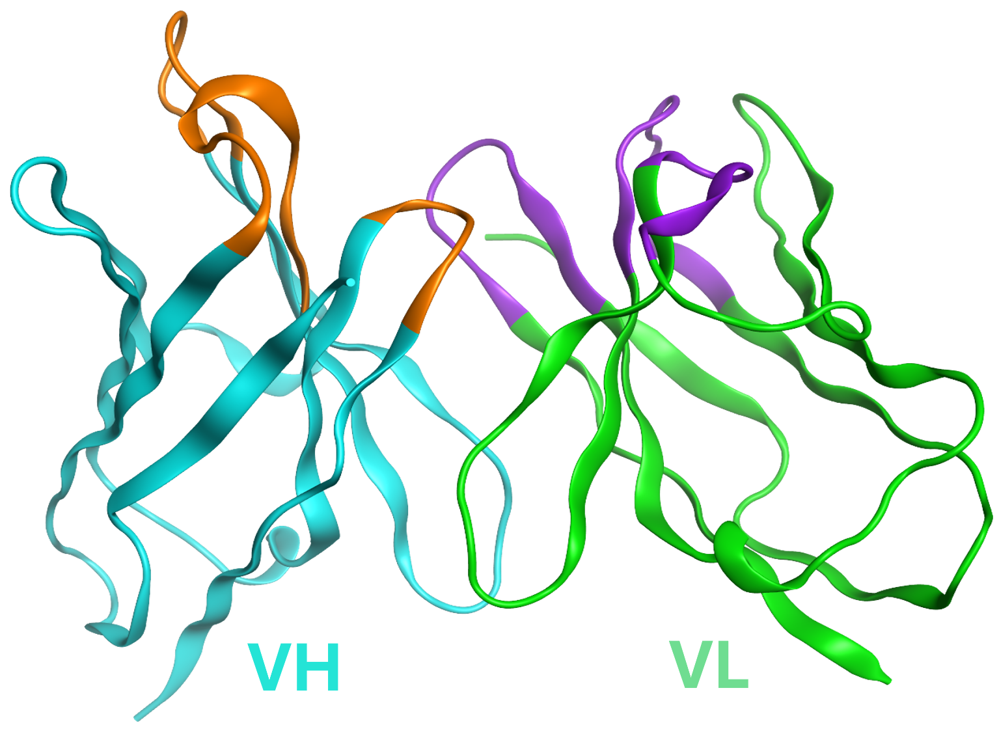

# In Silico Antibody Discovery with Generative AI

This project aims to generate human paired antibody sequences _in silico_, closely mimicking natural human antibodies, using advanced Generative AI (Gen-AI) models. The primary objective is to benchmark various deep learning models, including ProtGPT-2, ESM2, VAEs, and diffusion-based models, to evaluate their performance in antibody sequence generation.

## Folder descriptions 
### [`Paired_Seq_Data_Analysis/`](./Paired_Seq_Data_Analysis/)
Contains scripts and notebooks for preprocessing the paired human antibody sequence data downloaded from [OAS (Observed Antibody Space)](https://opig.stats.ox.ac.uk/webapps/oas/)

- [Sequence_Data_PreProcessing.ipynb](./Paired_Seq_Data_Analysis/Sequence_Data_PreProcessing.ipynb) : Notebook for preprocessing paired sequence data

### [`ProtGPT-2/`](./ProtGPT-2/)
This folder contains all necessary data, model, and scripts for working with ProtGPT-2, including:

- The trained [ProtGPT-2](./ProtGPT-2/models/protgpt2_antibody_model/) model specifically on human paired antibody sequences.
- Preprocessed datasets used for training
- Model training scripts (Pytorch)
- Configurations and scripts for generating novel antibody sequences
- Scripts for predicting the structure of generated sequences using [IgFold](https://github.com/Graylab/IgFold) and PyRosetta

## Data Source
The paired human antibody sequences were downloaded from OAS (Observed Antibody Space) database.

## References
- Existing ProtGPT-2 model is taken from Hugging face : https://huggingface.co/nferruz/ProtGPT2
- Research paper : https://doi.org/10.1038/s41467-022-32007-7
- IgFold : https://github.com/Graylab/IgFold
- IgFold research paper : https://doi.org/10.1038/s41467-023-38063-x
- OAS Database : https://opig.stats.ox.ac.uk/webapps/oas/
- OAS research paper : https://pubmed.ncbi.nlm.nih.gov/34655133/
- SAbDab (The Structural Antibody Database) : https://opig.stats.ox.ac.uk/webapps/sabdab-sabpred/sabdab

